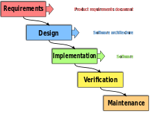

<h2> Conway`s game of life in c++</h2> 
<h4>by @lazarestas (thx to Nupellot and Bezzubik)</h4>

<h3>Rules</h3>
Rules
The universe of the Game of Life is an infinite, two-dimensional orthogonal grid of square cells,
each of which is in one of two possible states, live or dead (or populated and unpopulated, respectively).  
Every cell interacts with its eight neighbours, which are the cells that are horizontally, vertically, or diagonally adjacent.  
At each step in time, the following transitions occur: 
 
Any live cell with fewer than two live neighbours dies, as if by underpopulation. 
Any live cell with two or three live neighbours lives on to the next generation. 
Any live cell with more than three live neighbours dies, as if by overpopulation. 
Any dead cell with exactly three live neighbours becomes a live cell, as if by reproduction. 
These rules, which compare the behaviour of the automaton to real life, can be condensed into the following: 
 
Any live cell with two or three live neighbours survives. 
Any dead cell with three live neighbours becomes a live cell. 
All other live cells die in the next generation. Similarly, all other dead cells stay dead. 
The initial pattern constitutes the seed of the system.  
 
The first generation is created by applying the above rules simultaneously to every cell in the seed, live or dead;  
births and deaths occur simultaneously, and the discrete moment at which this happens is sometimes called a tick. 
Each generation is a pure function of the preceding one.  
The rules continue to be applied repeatedly to create further generations.

<h3>Requirements:</h3>

1. Working simulation with autoframechange (in console)
2. Errors should be working EVERYWHERE please future me do not ignore
3. Customizable field properties (such as x/y size and looping)
4. Start/stop functionality 
5. Importing/exporting from/to text file (and input standart)
6. Some stats and cycle detection
7. Example base
8. Building tools to correct the frame
9. Windows GUI (next lvl play aha)
10. end goal - cgl in cgl would be kinda cool

<h3> Design:</h3>

1. main logic v1
2. output and error handling v1
3. i/o v1
4. file interaction v1
5. stats place v1
6. general menu layout

//
notes on main logic v1  
THE FIELD will be built from 2d array of "Cells", which carry properties like dead/alive  
and their coordinates (not sure if i need coordinates)  
random filling the field will murder testing so for beginnig will use  
0000  
0110  
0100  
0000  
which is ok for the first test (lets name that CreateDefautArr)   
THE STEP for the simulation means that you need to take the field, convert to the following  
frame and write that to the existing one  
